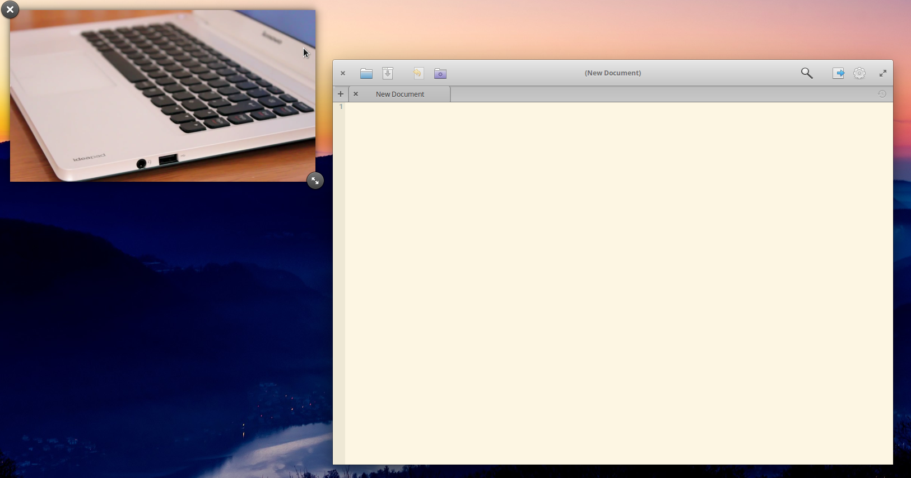

# ABANDONED
**This branch is abandoned since it got merged into Gala master itself as part of it's default set of plugins (in https://github.com/elementary/gala/commit/52678172d39b77881db1b6bc3cf5f167da52f4da). The development will now only happen in Gala's master branch. Please do not file any new bugs or feature requests here, instead file them here: https://github.com/elementary/gala/issues**

# Gala Picture In Picture plugin
A simple [Gala](https://github.com/elementary/gala) plugin to have a Picture in Picture functionality. It works by selecting a particular window or it's area you want to show in the popup window.



## Usage
To activate a window selection, hit **Super + D** and select a window. A popup window with live preview will show at the bottom left of the screen. You can move it to whatever position on the screen you like. You can also select a specific area of a window by dragging across it, similar to how you select an area in the Screenshot Tool. The selected area will be applied to the currently focused window. 

The window can be closed / resized simply by hovering over the popup window. This is also similar to how closing a notification works in Gala. 

## Installation

### Dependencies
These dependencies must be present before building:
- `cmake`
- `valac`
- `libgala-dev`
- `libgranite-dev`

You can install these on a Ubuntu-based system by executing this command:
`sudo apt install valac libgranite-dev libgala-dev cmake`

### Building
Open the root directory of this project and in your terminal execute:
```bash
$ mkdir build && cd build
$ cmake .. -DCMAKE_INSTALL_PREFIX=/usr
$ make
```

### Installing
After the building ended, without closing the terminal, execute this command as root: 
```bash
$ make install
```

### Running
After successfull installation, you need to restart gala in order to load the plugin. This can be done by simply restarting your system or a much more dangerous way: executing a `gala --replace` in your terminal (keep in mind that, that when you replace Gala in a terminal session, it has to be running all the time, otherwise, when the session is closed / killed, your system will become unusable due to lack of the WM).
